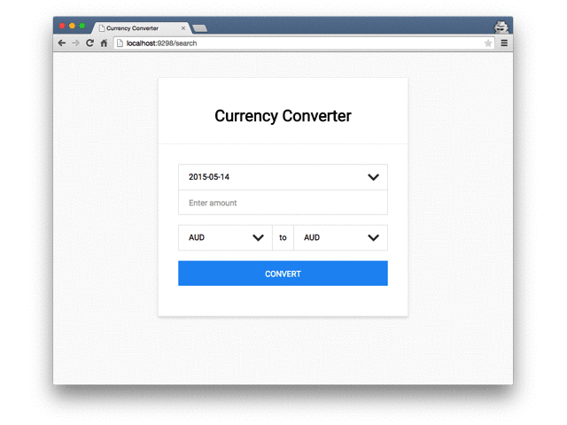

# Currency Converter Developer Test

### Solution

* [FXRate Service](https://goo.gl/gc8Soc)
  * Persists data for a given provider and expose searched rate.
* [FXRate Wrapper](https://goo.gl/89qcip)
  * Wrapper Gem called `ExchangeRate` which exposes FXRate Service functionally.
* [FXRate Demo App](https://goo.gl/mmZTWi)
  * Demo Application showing the use of the FXRate Service.

### Specification

[Original PDF Spec](./test.pdf)

### Note

* Each readme contains features that were excluded.

### Resources

1. [ECD Statistical Data Warehouse](https://sdw.ecb.europa.eu/curConverter.do)
 	* Use to confirm currency conversion accuracy for ECB provider
