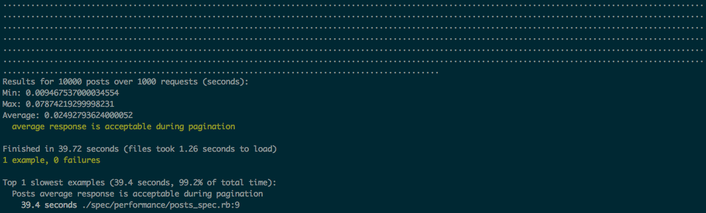

## News Feed

Managing lists of content in a social network is a required technical challenge and can be solved in a number of ways. Imagine a feature like the Facebook news feed. An infinitely scrolling list of items where each user has potentially millions of items.

Implement an active model or set of models and associated route/controller to match this feature. The model should scale to millions of records and still respond within an acceptable time frame. It should include the users name, their geo location and their profile picture.
The controller responds with JSON. The results should be paged from the client.

- Ensure a consistent memory footprint as the client pages through the result set.
- Pay attention to the response time using explain analyse (specifically postgresql).
- Add the relevant indexes to speed up the model query where necessary.

Write supporting tests using rspec.
Share your explain analyse output and your db schema.
Implement the rails MVC pattern for this feature.

- [x] Generate Rails Application
- [x] User (name, latitude, longitude, avatar)
- [x] Post (Title, Description) `/posts`
- [x] Pagination `posts?page=2&per_page=10`
- [x] Benchmark
- [x] Export final explain analysis

Developer Comments:

- [JSON API](http://jsonapi.org/) excluded for simplicity of response. The cost of the user include for posts would be removed.
- Unused endpoints omitted for clarity.

### Installation

Ruby 2.x and PostgreSQL 9.x are required:

    $ bin/setup

Start Server:

    $ bin/rails server

Run RSpec, Brakeman and Rubocop:

    $ bin/test

Run Performance Specs:

    $ bin/rspec spec/performance --tag performance

Example output showing the performance results from paging through 1000 pages to view 10,000 posts.



### Example Response

GET `/posts`
``` json
{
  "posts":[
    {
      "id": 10,
      "title": "Dicta sunt in excepturi sint odio ipsum et.",
      "body": "Minima ex consequatur repellendus. Molestiae tenetur consequatur qui possimus voluptates non ducimus. Ea occaecati qui assumenda quis velit. In suscipit qui minima qui et dolor at.",
      "user":{
        "id": 1,
        "name": "Chuck J Hardy",
        "avatar": "https://robohash.org/eniminconsequatur.png?size=300x300&set=set1",
        "latitude": "51.5034",
        "longitude": "-0.1276"
      }
    }
  ]
}
```

### Explain Analyse

Posts:

    $ EXPLAIN ANALYZE SELECT posts.* FROM posts LIMIT 10 OFFSET 20;

[View Results](http://explain.depesz.com/s/iduj)

    Limit  (cost=0.84..1.25 rows=10 width=221) (actual time=0.011..0.013 rows=10 loops=1)
      ->  Seq Scan on posts  (cost=0.00..46.00 rows=1100 width=221) (actual time=0.006..0.008 rows=30 loops=1)
    Planning time: 0.077 ms
    Execution time: 0.035 ms
    (4 rows)

Nested User (remove with JSON-API adapter):

    $ EXPLAIN ANALYZE SELECT users.* FROM users WHERE users.id IN (2, 3, 4, 5, 6, 7, 8, 9, 10, 11);

[View Results](http://explain.depesz.com/s/N7Ls)

    Index Scan using users_pkey on users  (cost=0.29..26.96 rows=10 width=112) (actual time=0.024..0.039 rows=10 loops=1)
      Index Cond: (id = ANY ('{2,3,4,5,6,7,8,9,10,11}'::integer[]))
    Planning time: 0.556 ms
    Execution time: 0.088 ms
    (4 rows)


### Todo

- [ ] Serializers Cache
- [ ] Versioning
- [ ] Pagination metadata
- [ ] Users CRUD
- [ ] Complete Posts CRUD
